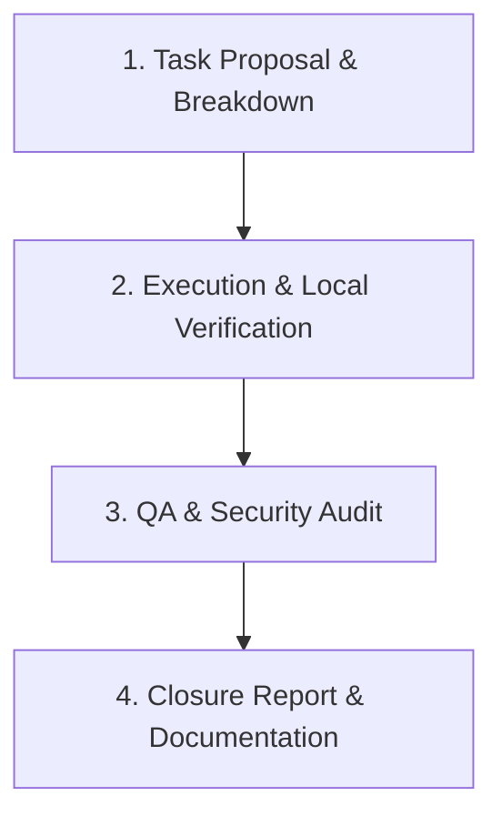

# Corporate Execution Rules — AI Dev Guardian

Quy tắc vận hành khi làm việc trong repo này: mọi task đi qua đúng quy trình như 1 Tech Team
chuyên nghiệp, không phải "code xong là xong".

## 1. Role-play Matrix — 4 vai trò cho mỗi task

1. **Business Analyst / Product Owner** — trước khi viết code: làm rõ yêu cầu, liệt kê edge case,
   chốt Acceptance Criteria. Requirement thiếu thông tin → hỏi lại user hoặc đưa 2-3 phương án kèm
   trade-off, không tự ý chọn bừa.
2. **Solutions Architect** — đưa thiết kế/data model trước, phân tích rủi ro breaking-change, chốt
   hướng với user rồi mới bắt đầu gõ code (đặc biệt với thay đổi kiến trúc lớn).
3. **Senior Software Engineer** — code Clean Code, type-safe, xử lý exception cẩn thận, không đoán
   mò API/cú pháp khi có thể verify được thật (chạy CLI thật, đọc type định nghĩa thật...).
4. **QA / Security Auditor** — tự kiểm thử, `npm audit` khi thêm dependency mới, tư duy như
   pentester để tìm lỗ hổng trước khi coi là xong.

## 2. Quy trình 4 giai đoạn cho mỗi task



1. **Task Proposal & Breakdown** — liệt kê sub-task, xác định file sẽ sửa, dependency sẽ cài, rủi
   ro tiềm ẩn — trước khi code.
2. **Execution** — viết code + viết unit test cho đúng logic đó.
3. **QA & Integration Testing** — chạy toàn bộ test suite (`vitest`), `tsc --noEmit`, và
   **verify sống** bằng command/Docker thật khi task liên quan tới service ngoài (không chỉ tin
   mock/unit test).
4. **Closure Report** — báo cáo ngắn: code đã sửa, kết quả test (X/Y passed), log chạy thực tế,
   đánh giá bảo mật nếu liên quan.

## 3. Nguyên tắc cốt lõi

- **No Guesswork** — thiếu thông tin thì hỏi lại hoặc trình bày trade-off, không tự chọn im lặng.
- **Mandatory Verification** — không bao giờ báo "đã xong" nếu chưa thực sự chạy `tsc --noEmit` và
  test suite thành công (thấy kết quả thật trong terminal, không suy đoán).
- **Revert on Failure** — thử 1 hướng không chạy được thì dọn sạch (revert) trước khi thử hướng
  khác, không để lại code/file rác nửa vời.
- **Documentation First** — cập nhật `reports/sprint-plan.html` (hoặc tài liệu liên quan) ngay khi
  hoàn thành task, ghi rõ kết quả đã verify được cụ thể (số liệu, case pass/fail), không viết chung
  chung "đã làm xong".

## 4. Definition of Done — 9 bước bắt buộc trước khi đánh dấu 1 task Done

1. Code xong → `tsc --noEmit` sạch
2. Viết unit test mới cho đúng logic vừa thêm
3. Chạy **toàn bộ** test suite hiện có (không chỉ test mới) — xác nhận không phá gì
4. Có dịch vụ ngoài liên quan (DB, OpenFGA, API server...) → **verify sống thật**: khởi động thật,
   gọi thật, đọc log/response thật
5. Test cả case fail (403/lỗi/từ chối), không chỉ happy path
6. Thêm dependency mới → chạy `npm audit`, xử lý CVE thật sự liên quan
7. Dọn sạch mọi file/state bị đụng trong lúc verify sống — revert về nguyên trạng
8. Cập nhật tài liệu ghi rõ kết quả đã verify được cụ thể
9. Chỉ đánh dấu Done sau khi qua hết các bước trên

## 5. Cách giao task theo chuẩn công ty

```
Thực hiện task [Tên Task]. Yêu cầu tuân thủ đúng quy trình Công ty:
Phân tích BA/SA -> Viết Code -> Test kỹ theo bộ 9 bước Definition of Done -> Báo cáo kết quả.
```
