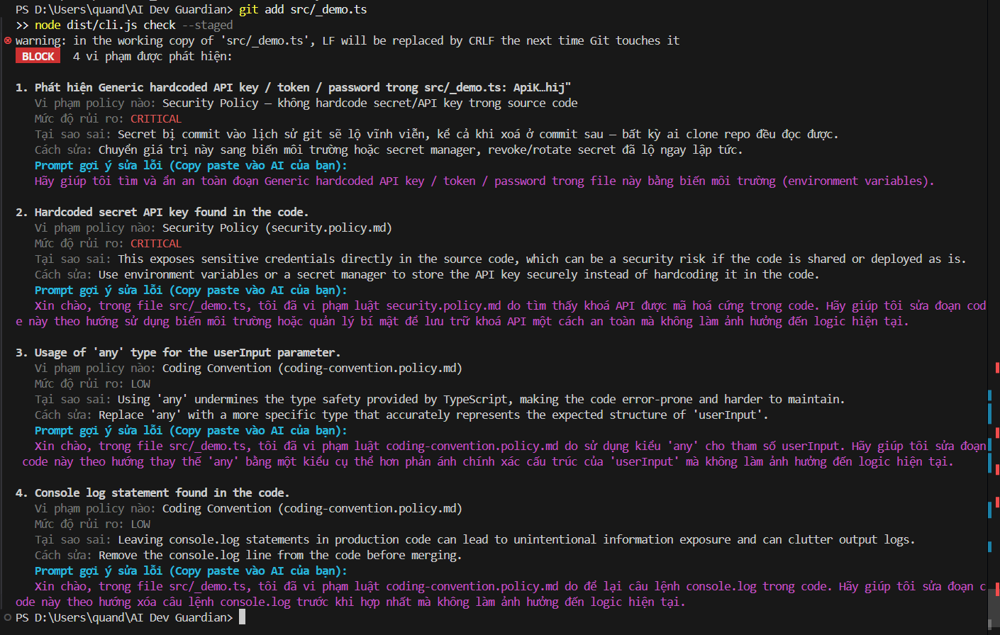
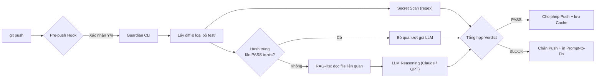

<div align="center">

# AI Dev Guardian

**The Open-source AI Engineering Governance Agent.**
**Shift-left your code quality!**

[](https://www.npmjs.com/package/ai-dev-guardian)
[](https://opensource.org/licenses/MIT)
[](#đóng-góp)
[](https://nodejs.org)

</div>

---

AI Dev Guardian là một **AI Engineering Governance Agent**, đứng giữa developer và Git/CI-CD.
Trước khi code được push, Guardian tự động đối chiếu diff với **Project Policy** của chính dự
án bạn — không phải một linter chung chung, cũng không phải một lớp vỏ mỏng chỉ biết ném diff
vào LLM rồi in ra bất cứ thứ gì model trả lời. Khả năng suy luận ở đây được ràng buộc chặt chẽ,
đánh giá theo từng phạm vi cụ thể, và bám sát đúng luật *bạn* thật sự đã viết ra — xem
[vì sao điều đó quan trọng](#vì-sao-khả-năng-suy-luận-của-guardian-khác-biệt).

## Vì sao cần Guardian

- **Review thủ công tốn quá nhiều thời gian.**
  Reviewer cứ phải lặp đi lặp lại việc bắt lỗi convention, kiến trúc, bảo mật ở từng PR — công
  việc nhàm chán, dễ bỏ sót, nhưng không thể bỏ qua.
  → **Guardian tự động hoá bước này.** Mỗi lần `git push` đều được đối chiếu với luật thật của
  dự án (Policy as Code), không cần ai ngồi soi từng dòng nữa.

- **AI coding agent viết code rất nhanh nhưng không biết luật của bạn — và phần lớn công cụ "AI review" cũng vậy.**
  Copilot, Cursor, Claude Code giúp bạn code nhanh hơn, nhưng chúng không biết kiến trúc, coding
  convention hay chính sách bảo mật riêng của bạn. Và không ít công cụ AI review khác cũng thế —
  chúng chỉ ném diff vào một model rồi in ra nhận xét style chung chung.
  → **Cách Guardian suy luận thì khác.** Nó đọc code với ngữ cảnh thật (RAG-lite kéo thêm các
  file liên quan), đánh giá từng file riêng biệt chỉ với đúng policy áp dụng cho file đó, và về
  bản chất không thể trích dẫn một policy không hề tồn tại. Chi tiết ở phần dưới.

- **Gọi LLM ở mỗi lần push rất tốn tiền.**
  Mỗi lần push kích hoạt một lượt gọi LLM là một khoản chi phí — nhân với số dev × số lần push
  mỗi ngày sẽ đội chi phí rất nhanh.
  → **Smart diff caching (SHA-256)** đảm bảo Guardian không bao giờ trả tiền hai lần cho cùng
  một đoạn diff đã từng PASS.

## Xem thực tế



## Tính năng nổi bật

| Tính năng | Mô tả |
|---|---|
| **Context-Aware RAG-lite** | Không chỉ đọc diff — Guardian trích các câu lệnh `import` nội bộ trong file thay đổi và đọc kèm tối đa 3 file liên quan (10KB/file) để LLM hiểu đúng type/interface/function thực sự đang được dùng. |
| **Multi-Provider LLM** | Dùng Anthropic Claude hoặc OpenAI GPT — tự động chọn theo API key đang có sẵn trong `.env`. |
| **Smart Diff Caching** | Hash SHA-256 của diff; bỏ qua hoàn toàn lượt gọi LLM nếu diff giống hệt lần chạy PASS gần nhất. |
| **Policy as Code** | Luật của dự án là các file Markdown thuần (`.guardian/policies/*.md`). LLM bị ép tuân thủ nghiêm ngặt qua JSON Schema (`policyId` enum) — không thể tự bịa ra policy không tồn tại. |
| **Prompt-as-a-Fix — Zero Risk** | Guardian không bao giờ tự vá code trực tiếp (quá rủi ro). Thay vào đó sinh sẵn một prompt để bạn copy-paste thẳng vào Copilot/ChatGPT/Claude của riêng mình. |
| **Deterministic Secret Scan** | Regex-based, miễn phí, luôn chạy kể cả khi chưa cấu hình API key nào. |
| **Git Hook tương tác, không bao giờ treo** | Hỏi xác nhận Y/n khi chạy trong terminal thật; tự fail-open (vẫn chạy check) trong CI/script để không bao giờ chặn pipeline. |

## Vì sao khả năng suy luận của Guardian khác biệt

Phần lớn các công cụ "AI code review" chỉ làm một việc: ném diff vào prompt rồi in ra bất cứ gì
model nói. Cách làm này dễ xây nhưng cũng chính là lý do chúng hay bịa ra luật, lẫn lộn đang nói
về file nào, và trôi dần sang những nhận xét style chung chung thay vì policy thật của dự án.
Pipeline suy luận của Guardian được thiết kế để không rơi vào tình trạng đó:

- **Không thể tự bịa ra policy.** Model không được tự mô tả vi phạm bằng lời của nó — mọi phản
  hồi đều bị ràng buộc bởi JSON Schema với `policyId` là một enum dựng từ đúng tập policy đã
  load cho file đó. Nội dung báo cáo cuối cùng luôn được dựng lại từ policy thật, không bao giờ
  tin nguyên văn text từ model. Nếu model trả về một id không nằm trong danh sách, vi phạm đó bị
  loại bỏ, không được đưa vào báo cáo.

- **Nhìn thấy nhiều hơn một đoạn diff.** Một diff thô thường thiếu đúng chi tiết quyết định kết
  quả — một comment nằm ngay phía trên vùng diff, một type được định nghĩa ở file khác. Guardian
  đưa cho model toàn bộ nội dung hiện tại của file đang thay đổi, cộng với (qua RAG-lite) tối đa
  3 file được import nội bộ mà nó phụ thuộc vào — để model suy luận với ngữ cảnh gần giống một
  reviewer con người thật sự có, chứ không phải một mảnh vỡ rời rạc.

- **Mỗi file một lượt đánh giá riêng, tập trung.** Thay vì nhồi cả một diff nhiều file vào một
  prompt duy nhất rồi hy vọng model nhớ đúng file nào áp dụng luật nào, Guardian chạy một lượt
  suy luận riêng cho từng file thay đổi, chỉ với đúng những policy có `scope` khớp file đó.
  Không lẫn lộn giữa các file, không bị loãng sự chú ý khi push lớn.

- **Bám sát luật của bạn, không phải "best practice" chung chung.** Model không bao giờ được hỏi
  "đoạn code này có tốt không?" — câu hỏi mà bất kỳ LLM nào cũng sẵn sàng trả lời bằng ý kiến
  chung chung. Nó được hỏi "đoạn này có vi phạm policy X, đúng như được viết trong
  `.guardian/policies/` của dự án này không?" — một câu hỏi hẹp hơn, có thể kiểm chứng được, cho
  ra kết quả nhất quán và đúng đặc thù dự án, thay vì những nhận xét style nghe có vẻ thông minh
  nhưng chung chung.

- **Biết dừng đúng lúc.** Tự sinh code vá lỗi là chỗ mà phần lớn tính năng "AI auto-fix" trở nên
  nguy hiểm — một bản vá biên dịch được nhưng phá vỡ logic còn tệ hơn không vá gì cả. Model của
  Guardian chỉ bao giờ được yêu cầu diễn đạt một *prompt nhờ sửa* thật chính xác
  (Prompt-as-a-Fix) — việc thay đổi code thật sự vẫn luôn là quyết định của bạn hoặc AI assistant
  riêng của bạn.

## Bắt đầu nhanh

**1. Cài đặt**

```bash
npm install
npm run build
npm link   # để dùng lệnh `guardian` toàn cục, hoặc chạy trực tiếp `node dist/cli.js`
```

**2. Cấu hình API key** — tạo file `.env` ở gốc project (đã có sẵn trong `.gitignore`):

```bash
# Chỉ cần điền MỘT trong hai key dưới đây
ANTHROPIC_API_KEY=sk-ant-...
OPENAI_API_KEY=sk-...

# Tuỳ chọn
GUARDIAN_LLM_PROVIDER=   # "anthropic" | "openai" — ép provider khi có cả 2 key
GUARDIAN_LLM_MODEL=      # đổi model mặc định (mặc định: claude-sonnet-5 / gpt-4.1)
```

> Không set key nào cũng không sao — Guardian vẫn chạy secret scan bình thường, chỉ log cảnh
> báo và bỏ qua phần kiểm tra bằng LLM.

**3. Chạy thử**

```bash
# Kiểm tra tay các thay đổi đã staged, trước khi commit
guardian check --staged

# Cài git pre-push hook — mỗi lần `git push` sẽ tự hỏi và chạy `guardian check`
guardian install-hook
```

Exit code `1` khi verdict `BLOCK` (có vi phạm mức `medium` trở lên), `0` khi `PASS` — sẵn sàng
dùng làm required check trong CI.

## Kiến trúc



## Viết Policy riêng cho dự án của bạn

Mỗi file trong `.guardian/policies/*.md` là một policy — YAML frontmatter cộng nội dung
Markdown (được đưa thẳng cho LLM, không qua xử lý trung gian):

```markdown
---
category: Security Policy
scope: ["src/**/*.ts"]   # rỗng ([]) nghĩa là áp dụng toàn cục
severity: critical        # low | medium | high | critical
tags: [security]
---

Nội dung quy định, viết như đang giải thích cho một developer.
```

`scope` dùng glob (qua `micromatch`) để chỉ gửi đúng policy liên quan tới file đã thay đổi cho
LLM — không nhồi toàn bộ policy library vào mỗi lần gọi.

```bash
npm test   # chạy toàn bộ unit test — không tốn API, không cần terminal thật
```

## Roadmap

**Đã có:** secret scan + LLM policy check (Security Policy, Coding Convention), CLI local, git
pre-push hook tương tác, cache theo diff hash, RAG-lite liên file, sinh prompt gợi ý sửa lỗi.

**Đang lên kế hoạch:** CI/GitHub Action gate, tích hợp Jira, và các category còn lại
(Architecture Rules, Git Workflow, Testing Standards, Dependency Rules, Business Requirements).

## Đóng góp

AI Dev Guardian vẫn đang ở giai đoạn MVP — mọi ý kiến, bug report hay Pull Request đều được
chào đón.

- Tìm thấy lỗi? Mở một Issue.
- Có ý tưởng tính năng? Cứ mạnh dạn đề xuất.
- Muốn code cùng? Fork, tạo branch, và gửi PR — không cần xin phép trước.

Nếu dự án này giúp ích cho bạn, hãy để lại một sao — đó là động lực lớn nhất để mình tiếp tục
phát triển nó.

<div align="center">

Made by DoanQuang and contributors.

</div>
