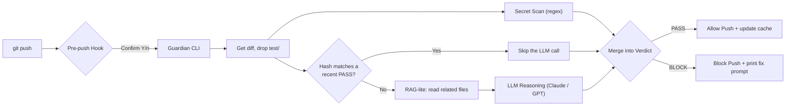

<div align="center">

# AI Dev Guardian

[](https://www.npmjs.com/package/ai-dev-guardian)
[](https://opensource.org/licenses/MIT)
[](https://nodejs.org)
[](#contributing)
[](https://github.com/dquangai/ai-dev-guardian/stargazers)

</div>

---

Policy-as-Code · scoped per-file reasoning · RAG-lite context · SHA-256 diff caching · zero auto-patch

AI Dev Guardian is an **AI engineering governance agent** that sits between a developer and Git/CI-CD. Before code gets pushed, Guardian checks the diff against your project's own **Project Policy** — not a generic linter, and not a thin wrapper that throws a diff at an LLM and prints back whatever it says. Reasoning is constrained, scoped per file, and grounded in rules *you* actually wrote — see [why that matters](#why-guardians-reasoning-is-different).

## Why Guardian

- **Manual review doesn't scale.** Reviewers re-catch the same convention, architecture, and security issues on every PR — tedious, easy to miss, impossible to skip. → **Guardian automates that step.** Every `git push` is checked against your project's real rules (Policy as Code), no one has to eyeball every line.

- **AI coding agents write fast but don't know your rules — and most "AI review" tools don't either.** Copilot, Cursor, and Claude Code make you faster, but they don't know your architecture, conventions, or security policy. Plenty of "AI review" tools have the same gap — they throw a diff at a model and print back generic style commentary. → **Guardian reasons differently.** It reads code with real context (RAG-lite pulls in related files), evaluates each changed file separately against only the policies that apply to it, and structurally cannot cite a policy that doesn't exist. Details below.

- **Calling an LLM on every push costs money.** Every push that triggers an LLM call is a cost — multiplied by devs × pushes/day, that adds up fast. → **SHA-256 diff-hash caching** means Guardian never pays twice for a diff that already passed.

## See it in action


## Install

```bash
npm install
npm run build
npm link   # exposes the `guardian` command globally; or run `node dist/cli.js` directly
```

## Quick Start

```bash
# 1. Configure an LLM key — create .env at the project root (already gitignored)
echo "ANTHROPIC_API_KEY=sk-ant-..." >> .env   # or OPENAI_API_KEY=sk-...

# 2. Check staged changes by hand, before committing
guardian check --staged

# 3. Install the pre-push hook — every `git push` prompts and runs `guardian check`
guardian install-hook
```

No key set is fine too — Guardian still runs the deterministic secret scan, logs a warning, and skips the LLM-powered checks.

Exit code `1` on a `BLOCK` verdict (any violation at `medium` severity or above), `0` on `PASS` — safe to wire in as a required CI check.

## Features

| Feature | Description |
|---|---|
| **Context-aware RAG-lite** | Doesn't just read the diff — extracts local `import`/`#include` statements from the changed file and pulls in up to 3 related files (10KB each) so the LLM sees the actual type/interface/function it's reasoning about. |
| **Multi-provider LLM** | Anthropic Claude or OpenAI GPT, auto-selected from whichever API key is present in `.env`. |
| **Smart diff caching** | SHA-256 hash of the diff, checked against the last 20 PASS results — skips the LLM call entirely on a repeat diff, even across branches. |
| **Policy as Code** | Project rules live as plain Markdown (`.guardian/policies/*.md`). The LLM is constrained via JSON Schema (`policyId` as an enum) — it cannot invent a policy that doesn't exist. |
| **Prompt-as-a-Fix — zero risk** | Guardian never patches code directly (too risky). Instead it generates a ready-to-paste prompt for your own Copilot/ChatGPT/Claude session. |
| **Deterministic secret scan** | Regex-based, free, always runs even with no API key configured. |
| **Interactive, never-hanging git hook** | Prompts Y/n in a real terminal; fails open (still runs the check) in CI/scripts so it never blocks a pipeline. |

## Why Guardian's reasoning is different

Most "AI code review" tools do one thing: throw a diff into a prompt and print whatever the model says. That's easy to build, and it's exactly why they tend to invent rules, lose track of which file they're talking about, and drift into generic style commentary instead of the project's actual policy. Guardian's reasoning pipeline is built to avoid that:

- **Can't invent a policy.** The model is never asked to describe a violation in its own words — every response is constrained by a JSON Schema whose `policyId` is an enum built from exactly the policies loaded for that file. The final report is always reconstructed from the real policy text, never trusted verbatim from the model. An id outside that enum is dropped, not reported.

- **Sees more than a raw diff.** A raw diff usually lacks the detail that decides the outcome — a comment just above the hunk, a type defined in another file. Guardian hands the model the full current content of the changed file, plus (via RAG-lite) up to 3 locally-imported files it depends on — context close to what a human reviewer would actually have, not a disconnected fragment.

- **One focused pass per file.** Instead of stuffing a multi-file diff into a single prompt and hoping the model remembers which rule applies to which file, Guardian runs a separate reasoning pass per changed file, scoped to only the policies whose `scope` matches that file. No cross-file confusion, no diluted attention on large pushes.

- **Your rules, not generic "best practice."** The model is never asked "is this code good?" — a question any LLM will happily answer with a generic opinion. It's asked "does this violate policy X, as written in this project's `.guardian/policies/`?" — a narrower, verifiable question that produces consistent, project-specific results instead of plausible-sounding platitudes.

- **Knows when to stop.** Auto-generating a fix is where most "AI auto-fix" features turn dangerous — a patch that compiles but breaks logic is worse than no patch. Guardian's model is only ever asked to phrase a precise *fix-request prompt* (Prompt-as-a-Fix) — the actual code change stays your call, or your own AI assistant's.

## RAG-lite: supported languages

Local-import resolution (best-effort, not a full parser) currently covers:

- TypeScript/JavaScript (full support) — `import ... from "./x"`
- Python (full support) — `from .foo import x`, `from . import pkg`
- C/C++ (full support) — `#include "relative/path.h"`
- Go (full support) — resolved via `go.mod`'s module path, picks the first non-test `.go` file in the imported package directory

Any other file extension is checked on diff content alone, with no satellite context pulled in.

## Architecture



## Writing policies for your project

Each file under `.guardian/policies/*.md` is one policy — YAML frontmatter plus Markdown body (handed to the LLM as-is, no intermediate processing):

```markdown
---
category: Security Policy
scope: ["src/**/*.ts"]   # [] means it applies globally
severity: critical        # low | medium | high | critical
tags: [security]
---

The rule itself, written like you're explaining it to a developer.
```

`scope` uses glob matching (via `micromatch`) so only the policies relevant to each changed file are sent to the LLM — the full policy library is never stuffed into a single call.

```bash
npm test   # runs the full unit test suite — no API calls, no real terminal needed
```

## Roadmap

| Feature | Status | Details |
|---|---|---|
| Deterministic secret scan | Done | Regex-based, free, always runs |
| LLM policy check | Done | Security Policy, Coding Convention categories |
| Policy as Code | Done | Markdown + YAML frontmatter, scope-routed via glob |
| Prompt-as-a-Fix | Done | Model generates a fix-request prompt, never a direct patch |
| Interactive pre-push git hook | Done | Y/n in a real terminal, fail-open in CI/scripts |
| SHA-256 diff-hash caching | Done | LRU of the last 20 PASS hashes, survives branch switching |
| Inter-file RAG-lite context | Done | TypeScript/JavaScript, Python, C/C++, Go |
| CI / GitHub Action gate | Planned | Required-check integration with a git-versioned baseline |
| Jira integration | Planned | Link policy violations to tracked issues |
| Architecture Rules category | Planned | Dependency-direction rules (e.g. "module A must not import module B") |
| Git Workflow category | Planned | Branch naming, commit message, merge strategy policies |
| Testing Standards category | Planned | Coverage and test-quality policies |
| Dependency Rules category | Planned | Allowed/forbidden package policies |
| Business Requirements category | Planned | Domain-specific rule policies |

## Contributing

AI Dev Guardian is still at the MVP stage — feedback, bug reports, and pull requests are all welcome.

- Found a bug? Open an issue.
- Have a feature idea? Propose it, no need to ask first.
- Want to contribute code? Fork, branch, and send a PR.

If this project is useful to you, a star helps a lot — it's the biggest motivation to keep building it.

<div align="center">

Made by DoanQuang and contributors.

</div>
