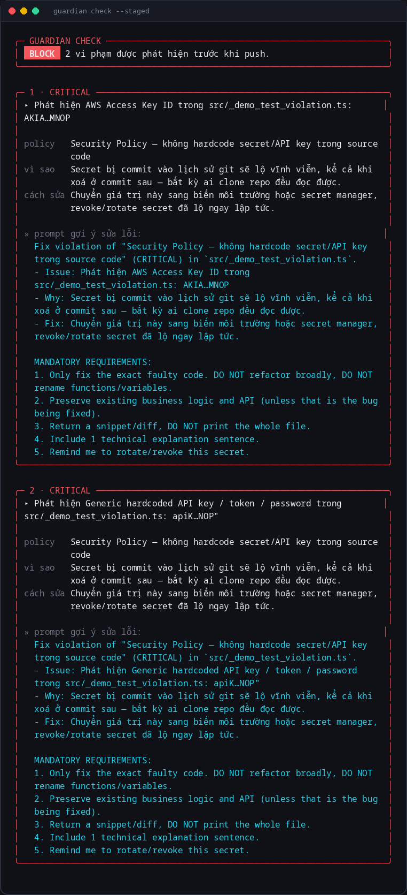
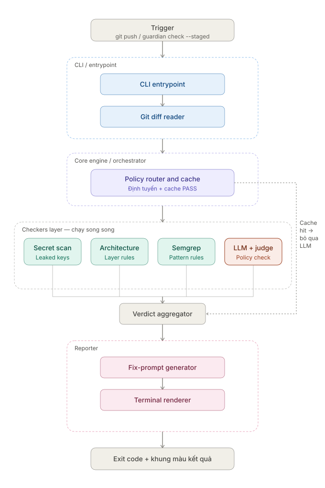

<div align="center">

# AI Dev Guardian

[](https://www.npmjs.com/package/ai-dev-guardian)
[](https://www.npmjs.com/package/ai-dev-guardian)
[](https://opensource.org/licenses/MIT)
[](https://nodejs.org)
[](#contributing)
[](https://github.com/dquangai/ai-dev-guardian/stargazers)

</div>

---

4 independent checks per push · evidence-grounded + judge-verified LLM reasoning · zero auto-patch · one `npm install`

AI Dev Guardian is a Node/TypeScript CLI and git pre-push hook that gates a push against a
project's own **Project Policy**. It is not a linter and not a thin LLM wrapper: every check runs
scoped to the current diff, every LLM claim is cross-checked against the real diff text before
being trusted, and the tool never writes code on your behalf — it only ever proposes a
copy-paste-ready fix prompt.

<div align="center">

</div>

## Install

`ai-dev-guardian` is [published on npm](https://www.npmjs.com/package/ai-dev-guardian) — install it
globally in whichever project you want to gate:

```bash
npm install -g ai-dev-guardian
guardian install-hook
guardian dashboard
```

Or run it without a global install via `npx`:

```bash
npx ai-dev-guardian install-hook
npx ai-dev-guardian dashboard
```

### Development setup (working on Guardian itself)

To build and run this repo's own source instead of the published package:

```bash
npm install
npm run build:all   # compiles the CLI/server (dist/) and builds the dashboard UI (web/dist)
npm link             # exposes the `guardian` command globally from this checkout, pointing at dist/
```

`npm link` symlinks to this repo's `dist/`, not `src/` — re-run `npm run build:all` here after any
source change, linked projects won't see it otherwise. On Windows, creating the symlink may need
Developer Mode enabled or an elevated terminal (`EPERM` otherwise). To undo: `npm unlink
ai-dev-guardian` in the linked project, then `npm unlink` in this repo.

## Quick Start

```bash
# 1. Configure an LLM key — create .env at the project root (already gitignored)
echo "ANTHROPIC_API_KEY=sk-ant-..." >> .env   # or OPENAI_API_KEY=sk-...

# 2. Check staged changes by hand, before committing
guardian check --staged

# 3. Install the pre-push hook — every `git push` prompts and runs `guardian check`
guardian install-hook

# 4. Optional: manage policies/audits from a web dashboard instead of the terminal
guardian dashboard   # serves API + UI on one port — see Web Dashboard below
```

Programmatic usage is the same entry point the CLI calls (`src/orchestrator.ts`):

```ts
import { runGuardianCheck } from "ai-dev-guardian/dist/orchestrator";
import { getStagedDiff } from "ai-dev-guardian/dist/git/diff";

const diff = await getStagedDiff();
const report = await runGuardianCheck(diff);
// report.verdict: "PASS" | "BLOCK"
// report.violations: Violation[] — see src/report/types.ts
```

No LLM key set is fine — Guardian still runs the 3 deterministic checks (secret scan,
circular-dependency check, and Semgrep if installed), logs a warning, and skips the LLM-powered
policy check. Exit code `1` on `BLOCK` (any violation at `medium` severity or above), `0` on
`PASS` — safe to wire in as a required CI check.

## Architecture

<div align="center">

</div>

Layered top-down, matching the app's own lifecycle: **CLI/Entrypoint** reads the diff → **Core
Engine/Orchestrator** routes the applicable policies and checks the diff-hash cache → fans out to
the **Checkers layer** (all 4 run concurrently; a cache hit bypasses only the `LLM + judge`
branch, never the 3 deterministic ones) → fans back into the **Verdict Aggregator** → **Reporter**
builds the fix prompt and renders the terminal output.

`runGuardianCheck` (`src/orchestrator.ts`) runs all 4 checks concurrently via `Promise.all`, then
merges every `Violation[]` into one report. Every collaborator — `loadPolicies`,
`scanForSecrets`, `checkPoliciesWithLLM`, `checkCircularDependencies`, `checkWithSemgrep`,
`readCache`, `writeCache` — is injected through an `OrchestratorDeps` interface with
`deps.X ?? X` fallback to the real implementation, so every check is independently unit-testable
without touching the filesystem, git, or a real LLM/binary. A verdict is `BLOCK` iff at least one
violation has `riskLevel` in `{medium, high, critical}` (`BLOCKING_SEVERITIES` in
`orchestrator.ts`); `low` findings are reported but never block.

## Checks

| Check | File | Deterministic? | Scope |
|---|---|---|---|
| **Secret scan** | `src/checks/secretScan.ts` | Yes (regex) | Added (`+`) diff lines only — AWS keys, generic API key/token/password patterns, PEM private keys, Slack/GitHub tokens |
| **LLM policy check** | `src/checks/llmPolicyCheck.ts` | No (Claude/GPT) | One call per changed file, scoped to only the policies whose `scope` glob matches that file |
| **Circular dependency check** | `src/checks/architectureCheck.ts` | Yes (madge) | TS/JS/JSX/MJS/CJS only; reports a cycle only if this diff's `changedFiles` intersect it |
| **Semgrep check** | `src/checks/semgrepCheck.ts` | Yes (Semgrep CLI, optional) | Findings filtered to lines this diff actually added, via `addedLineNumbers()` |

Secret scan and the circular-dependency check always run — they're free. The LLM check is
skipped when no `ANTHROPIC_API_KEY`/`OPENAI_API_KEY` is set, or when the diff hash matches a
recent `PASS` (see [Caching](#caching)). The Semgrep check is skipped when the `semgrep` binary
isn't found in `PATH` — in both skip cases Guardian logs a warning and continues, never blocking
the push over a missing optional dependency.

## LLM reasoning: 5 layers against hallucination

The LLM is never asked to freely describe a violation. It must call a `report_violations` tool
whose JSON Schema (`src/checks/llm/types.ts`) constrains every field:

- **`policyId`** is a `enum` built from exactly the policy ids loaded for that file. A response
  outside that enum is dropped before it ever reaches the report — the model cannot cite a policy
  that doesn't exist, and the final report text is always reconstructed from the real policy
  file, never trusted verbatim from the model.
- **`reasoning`** is declared *first* in the schema and required before every other field —
  forces the model to work through (1) what the code actually does, (2) what the policy requires,
  (3) whether it really contradicts the policy, before it's allowed to commit to a verdict.
  Declared-property order is what makes structured tool-calling generate this chain-of-thought
  before the conclusion, not after.
- **`evidenceSnippet`** must be the exact line(s) copied from the diff that trigger the
  violation. `isEvidenceGrounded()` in `llmPolicyCheck.ts` splits it into trimmed lines and
  requires every one to occur verbatim in the file's real diff text (comment-only lines excluded
  from the valid pool — see [AST annotation](#ast-annotation-comment-vs-code) below) — a claim
  that can't be traced back to actual code is dropped, the same grounding mechanism as `policyId`.
- **`riskLevel: "critical"`** — the one severity that alone blocks a push — additionally requires
  self-consistency: on any first-pass `critical` finding, `checkPoliciesWithLLM` re-runs the
  *identical* prompt against the same file a second time and keeps the finding only if the same
  `policyId` appears in both passes. A disagreement between the two independent passes is treated
  as a false positive and dropped, at the cost of exactly one extra LLM call — paid only on the
  pushes that actually contain a critical finding, not on every push.
- **Every surviving violation** (any severity, not just `critical`) then goes through an
  independent [judge pass](#llm-as-a-judge-second-opinion-on-every-violation) — see below.

Every file is reasoned about independently: one prompt per changed file, containing only the
policies whose `scope` glob (matched via `micromatch`) applies to that file — never a multi-file
diff crammed into a single call.

## AST annotation: comment vs. code

Grounding proves a quote is *real*; it doesn't prove the quote means what the model says it
means. Observed in practice: a JSDoc sentence like `// Fail-safe: any madge error...` grounds
successfully for a claim like "uses the `any` type" — the model quoted a real line, but that
line is prose describing the code, not code using `any`.

`annotateForLLM()` (`src/checks/llm/annotate.ts`) closes that gap structurally for TS/JS/JSX/TSX
(ast-grep's built-in languages — Python/C/Go fall back to unannotated content): before the
current file content and satellite files are shown to the model, every `comment`,
`string`, and `template_string` AST node is wrapped in `<comment>...</comment>` /
`<string>...</string>` tags. The prompt then instructs the model that `<comment>` content is
never executing code, and that `<string>` content is only valid evidence if the string's own
*value* is the problem (e.g. a hardcoded secret) — not if it merely *describes* something in
natural language. Fails open to unannotated content on any parse error.

## LLM-as-a-Judge: second opinion on every violation

Grounding and annotation stop claims that quote a comment or invent evidence outright — they
don't stop the model quoting *real, non-comment code* and still asserting something false about
it (e.g. claiming a 24-line function "has more than 50 lines"). Self-consistency doesn't catch
this either, since it only reruns `critical` findings and this class of error showed up
reproducibly at `medium`/`low`.

After grounding (and critical self-consistency) narrow a file's violations down to survivors,
`checkPoliciesWithLLM` sends them — batched, one extra call per *file*, not per violation — to a
second model via `resolveJudgeClient()` (`src/checks/llm/resolveClient.ts`), asking it to
independently re-derive each claim from the real file/diff content (explicitly instructed to
recount rather than trust the original claim's wording) and return a `judge_claims` verdict per
claim. A violation is dropped only if the judge explicitly returns `claimIsTrue: false` for it.

- Same provider/API key as the main check — no separate key needed — but a cheaper/faster model
  by default (`DEFAULT_ANTHROPIC_JUDGE_MODEL` / `DEFAULT_OPENAI_JUDGE_MODEL`), overridable via
  `GUARDIAN_JUDGE_MODEL` in `.env`.
- Zero cost on clean files (only runs when a file has survivors); fails open on any error or
  missing key — the judge can only *remove* false positives, never make Guardian less reliable
  than before this layer existed.
- Verified against a real, previously-reproducible false positive (a 24-line function
  hallucinated as ">50 lines", `medium` severity, enough to `BLOCK` a real push three separate
  times before this layer existed): the judge re-counted the real code and correctly rejected the
  claim, flipping the verdict from `BLOCK` to `PASS`.

## Evaluation: measuring the LLM check against a golden dataset

Every mechanism above (grounding, judge, self-consistency) is a claim about how the LLM check
*should* behave — `eval/` is what actually measures it, against 100 hand-written cases
(`eval/dataset/cases.ts`: 51 `true-positive` cases seeded with a real violation, 49
`false-positive-trap` cases that closely resemble a violation but are actually compliant, each
modeled on one of the policy files' own "Ví dụ KHÔNG vi phạm" examples). Every case is a synthetic
diff (`DiffResult`) fed straight into the real `runGuardianCheck()` — no mock LLM provider; every
run is real API calls against the real `.guardian/policies/*.md` files.

```bash
npm run eval                                    # full 100-case run, real API calls
npm run eval -- --case=tp-01-aws-secret         # just one case, cheap iteration while debugging
npm run eval -- --case=tp-01-aws-secret,fp-08-local-cli-no-auth-needed   # comma-separated, multiple
npm run eval -- --split-policies                # diagnostic: 1 LLM call per matched policy, not
                                                 # bundled per file — tests whether packing ~11
                                                 # policies into one prompt causes context saturation
npm run eval -- --ci                            # gate mode: exit 1 if below DEFAULT_THRESHOLDS
npm run eval:matrix                             # same 100 cases across every configured provider/model
```

A `--case=...` or `--split-policies` run is diagnostic-only: it prints results but never writes
`eval/results/` or a history snapshot, since a 1-2 case subset or a different execution mode isn't
a real measurement of the full-suite baseline. A plain `npm run eval` writes
`eval/results/latest.json`/`.md`, records an immutable snapshot under
`eval/results/history/<timestamp>.json` (provider, model, commit SHA, full pass/fail list), and
prints a colored Delta against the most recently recorded snapshot — so a regression from an
unrelated prompt/policy edit is visible immediately, not just the final numbers.

**Latest verified run** (`gpt-4o` via OpenAI, 100 cases, real API, 2026-08-12): **Recall 96.1%**
(49/51 true-positive cases correctly caught), **Precision 94.2%**, **False Positive Rate 6.1%**
(3/49 traps misfired). Recorded as an immutable snapshot under `eval/results/history/` (gitignored
local run output, not checked in — every `npm run eval` writes its own; re-run it yourself to
reproduce). `eval/checkThresholds.ts`'s `DEFAULT_THRESHOLDS` (Recall ≥ 85%, Precision ≥ 80%, FPR ≤
25%) gate `--ci` mode; the default mode always exits `0` — informational only, since a single
run's numbers carry real LLM sampling variance and shouldn't hard-fail CI on their own.

`.github/workflows/eval.yml` runs the same suite on `workflow_dispatch`, a nightly `schedule`
(catches drift from a provider-side model update even on a day nobody touches a policy file), and
any PR touching `src/checks/llm/**`, `src/checks/llmPolicyCheck.ts`, `.guardian/policies/**`, or
`eval/**` — posting/updating a single PR comment via `postOrUpdateComment` (same dedup-by-marker
mechanism as Guardian's own check-report comment, parameterized so the two never collide).

## RAG-lite: per-language context retrieval

Before the LLM call, `src/checks/llm/fileContext.ts` pulls in up to `MAX_SATELLITE_FILES = 3`
locally-imported files (each capped at `SATELLITE_MAX_BYTES = 10_000` bytes) alongside the
changed file's own full content (capped at `DEFAULT_MAX_BYTES = 20_000` bytes), so the model
reasons with the actual type/interface/function definitions the diff depends on.

Extraction is language-specific, dispatched by file extension:

| Language | Extraction | Resolution |
|---|---|---|
| TS/JS/JSX/MJS/CJS | Real parser via `@ast-grep/napi` (tree-sitter) — walks `import_statement`/`export_statement` nodes' `source` field, plus `call_expression` nodes whose callee is `require`/`import`. Falls back to a regex extractor (`TS_IMPORT_REGEX`) if parsing throws or returns 0 results. | Tries suffixes `"", .ts, .tsx, .js, .jsx, /index.ts, /index.tsx"` relative to the importing file's directory |
| Python | Regex on `from X import Y` where `X` starts with `.` (relative only). Bare `from . import pkg` folds the first imported name into the specifier (`.pkg`) since a bare dot alone can't resolve to a submodule. | Dot-count walks up parent directories; remaining dots become path separators; tries `.py` then `/__init__.py` |
| C/C++ | Regex on `#include "relative/path.h"` — angle-bracket `#include <...>` (always a system header) is never matched. | Direct relative-path resolution, no extension guessing (includes always specify the full filename) |
| Go | Regex over `import (...)` blocks and single `import "..."` statements. | Reads the module path from `go.mod`; a specifier is local only if it's prefixed by that module path, and resolves to the first non-`_test.go` file in the corresponding package directory (Go imports name a package/directory, not a file) |

Any other extension gets diff-only context, no satellite files.

## Circular dependency detection

`checkCircularDependencies()` (`src/checks/architectureCheck.ts`) short-circuits to `[]`
immediately if no changed file has a TS/JS extension — no repo walk on unrelated pushes.
Otherwise it runs [madge](https://github.com/pahen/madge) against the whole project
(`fileExtensions: ["js","jsx","ts","tsx","mjs","cjs"]`, `tsConfig` auto-detected if
`tsconfig.json` exists, `node_modules`/`dist`/`.git`/`coverage` excluded) and calls
`.circular()` to get every cycle in the codebase. Paths are normalized to POSIX and a cycle is
only *reported* if at least one file in it is also in `diff.changedFiles` — Guardian never
flags a pre-existing cycle the current push doesn't touch. Any madge failure (missing tsconfig,
unparseable project) is swallowed and treated as "no violations," never blocking a push on its
own error. Fixed `riskLevel: "medium"` — there's no policy file governing this check yet (see
[Roadmap](#roadmap)).

## Optional Semgrep integration

`checkWithSemgrep()` (`src/checks/semgrepCheck.ts`) is the one check that shells out to an
external binary rather than an npm dependency. It:

1. Filters `diff.changedFiles` to paths that actually exist on disk, and returns `[]` without
   spawning anything if none do.
2. Runs `semgrep --config <config> --json --quiet <targets>`, where `<config>` defaults to the
   Semgrep Registry ruleset `p/security-audit` and is overridable via `GUARDIAN_SEMGREP_CONFIG`
   in `.env` (same override pattern as `GUARDIAN_LLM_PROVIDER`/`GUARDIAN_LLM_MODEL`).
3. On `ENOENT` (binary not found), logs one warning and returns `[]` — never treated as a
   blocking failure.
4. Cross-references every finding's `start.line` against `addedLineNumbers(diff.diffText, path)`
   (`src/git/diffLines.ts`, which walks unified-diff hunk headers to compute post-change line
   numbers) and drops any finding that lands on a line this diff didn't actually add — Semgrep
   scans whole files, but Guardian only ever judges the diff.
5. Maps `extra.severity`: `ERROR → high`, `WARNING → medium`, `INFO → low`.

## Policy as Code

Each file under `.guardian/policies/*.md` is one policy — YAML frontmatter plus a Markdown body
handed to the LLM verbatim, no intermediate summarization:

```markdown
---
category: Security Policy
scope: ["src/**/*.ts"]   # [] means it applies globally
severity: critical        # low | medium | high | critical
tags: [security]
---

The rule itself, written like you're explaining it to a developer.
```

Add a "Ví dụ vi phạm" / "Ví dụ KHÔNG vi phạm" (violating / non-violating example) block under any
rule prone to false positives — since the body is handed to the model verbatim, this is free
few-shot prompting with zero code changes, and `buildPrompt()` explicitly instructs the model to
follow example boundaries precisely. See `.guardian/policies/coding-convention.policy.md`'s `any`
rule for a real example: it disambiguates the TypeScript type `any` from the English word "any"
appearing in a comment, which the LLM check otherwise conflates in practice.

`loadPolicies()` (`src/policy/loader.ts`) reads every `.md` file under `.guardian/policies/`
(default via `DEFAULT_POLICY_DIR`), parsing frontmatter with `gray-matter` and defaulting
`severity` to `medium` if invalid/missing. `routePolicies()` (`src/policy/router.ts`) then
filters to only the policies relevant to the current diff — via `micromatch.isMatch` against each
policy's `scope` globs (a `scope: []` policy applies globally) — so the full policy library is
never stuffed into a single LLM call, and each file's prompt only carries the rules that could
possibly apply to it.

## Web Dashboard

A React + Vite + Tailwind dashboard (`web/`) backed by an Express API (`src/server/`), for a Dev
Team Lead who wants to manage policies and review audit history without reading terminal output.

```bash
npm run dev            # dev mode: API on :4000 (plain tsx, no watch — see note in package.json)
                        # + Vite dev server on :5173 (proxies /api to :4000)
# or, once web/dist exists (npm run web:build, or automatically via prepublishOnly):
guardian dashboard      # API + built UI on one port, single command
```

### RBAC

Four roles, one permission matrix (`src/server/rbac.ts`, mirrored read-only in
`web/src/lib/rbac.ts` for the frontend to gate buttons — but every permission is re-checked
server-side in `authMiddleware.ts`'s `requirePermission()`, never only hidden in the UI):

| Role | Can |
|---|---|
| **Admin** | Edit/delete policies directly, approve policy change requests, run audits, edit engine config |
| **Senior Dev-Lead** | Propose policy changes, approve policy change requests and bypass requests |
| **Developer** | Run audits, request bypasses, read-only on policies |
| **Auditor** | Read-only everywhere — no approve, no edit, no run |

Login issues a signed JWT (`src/server/token.ts`), not a role the client asserts. `POST
/api/auth/login` checks email + `GUARDIAN_DEMO_PASSWORD` (see `.env.example`) against the demo
user directory in `src/server/users.ts` — the only user store this tool has, since it's meant to
run locally alongside the CLI, not as a multi-tenant service. Every subsequent request carries
that token as `Authorization: Bearer <token>`; `requireAuth()` in `authMiddleware.ts` verifies it
and 401s on anything missing, malformed, expired, or tampered — there is no header the client can
set to claim a role anymore. The signing secret is a random value generated at server boot unless
`GUARDIAN_JWT_SECRET` is set, so by default every session ends on restart (log back in) rather
than trusting a secret that was never explicitly configured.

### Policy approval workflow

A role without `policy:edit-direct` submitting a create/update/delete gets a pending
`PolicyChangeRequest` (`.guardian/policy-requests.json`, gitignored runtime state) instead of
touching disk immediately. Admin or Senior Dev-Lead approves (writes/deletes the real
`.guardian/policies/*.md` file) or rejects it — see `src/server/store/policyStore.ts`.

### Bypass requests

When an audit run `BLOCK`s, any role can submit a reason for a merge bypass; Admin or Senior
Dev-Lead resolves it (`src/server/store/bypassStore.ts`). This is a record for accountability, not
an override mechanism — approving a bypass request doesn't change the git hook's exit code; a
human still has to decide to push past a `BLOCK` themselves.

### Audit history

Unlike the CLI (which prints a report and forgets it), every dashboard-triggered
`POST /api/audit/run` persists its `CheckReport` to `.guardian/audit-history.json` (gitignored,
capped at 200 runs, `src/server/store/auditStore.ts`) — this is what backs the Overview KPIs and
the Audit History page. `guardian check` from the terminal is unaffected and still stateless.

## Caching

`hashDiffText()` SHA-256-hashes the (test-file-excluded) diff text. `writeCache()`
(`src/cache.ts`) stores it in `.git/guardian_cache.json` as `passedDiffHashes: string[]` — an
LRU of the last `MAX_CACHED_HASHES = 20` hashes that produced a `PASS`, most-recent-first,
deduplicated. On the next run, if the current diff hash appears **anywhere** in that list — not
just the most recent entry — the LLM policy check is skipped entirely (secret scan, the
circular-dependency check, and Semgrep still run; they're free). This survives switching between
branches: a diff that passed on branch A is still cached if you check out branch B and back. A
`BLOCK` verdict is never cached, so a fixed diff is always re-checked.

## Prompt-as-a-Fix

Guardian never patches code directly — a patch that compiles but breaks logic is worse than no
patch. Every violation's `promptToFix` is instead a ready-to-paste natural-language request for
*your own* AI assistant (Copilot/ChatGPT/Claude), following a fixed template the LLM is
constrained to reproduce via the JSON Schema. The actual code change stays a human (or your own
assistant's) decision.

## Interactive git hook

`guardian install-hook` writes a pre-push hook that runs `guardian check`. In a real TTY it
prompts `Y/n` before running; in CI or any non-interactive script (`confirmOnTTY` detects
`process.stdin.isTTY`) it fails open — the check always runs, the prompt is skipped — so Guardian
never hangs a pipeline waiting on input that will never come.

```bash
npm test   # full unit test suite — no API calls, no semgrep/madge network access, no real terminal
```

## Roadmap

### Shipped

| Feature | Details |
|---|---|
| Deterministic secret scan | Regex rules for AWS keys, generic API key/token/password, PEM private keys, Slack/GitHub tokens; runs on added diff lines only, always on |
| LLM policy check | Per-file, per-policy-scope reasoning via Anthropic Claude or OpenAI GPT (auto-selected by which `.env` key is present) |
| Policy as Code | Markdown + YAML frontmatter under `.guardian/policies/`, glob-routed via `micromatch` |
| Evidence-grounded violations | `evidenceSnippet` must occur verbatim in the real diff text or the violation is dropped |
| Chain-of-thought reasoning field | `reasoning` required and declared first in the schema — forces think-before-conclude on every claim |
| AST comment/string annotation | TS/JS content shown to the LLM is tagged `<comment>`/`<string>` so it can't mistake prose for executing code |
| Self-consistency on critical findings | A second independent LLM pass must reproduce the same `policyId` before a `critical` verdict is kept |
| LLM-as-a-Judge second pass | Every surviving violation (any severity) is independently re-verified by a second, cheaper-model call before being kept |
| Prompt-as-a-Fix | Model generates a templated fix-request prompt; Guardian never writes code itself |
| SHA-256 diff-hash caching | LRU of last 20 `PASS` hashes in `.git/guardian_cache.json`, survives branch switching |
| Inter-file RAG-lite context | TypeScript/JavaScript (ast-grep, regex fallback), Python, C/C++, Go — up to 3 satellite files, 10KB each |
| Circular dependency detection | madge-backed, TS/JS only, scoped to cycles the current diff's `changedFiles` actually touch |
| Optional Semgrep integration | `p/security-audit` ruleset by default (`GUARDIAN_SEMGREP_CONFIG` overridable), findings filtered to added diff lines |
| Interactive pre-push git hook | `Y/n` in a real TTY, fail-open (always runs) in CI/non-interactive scripts |
| Web dashboard | React/Vite/Tailwind UI + Express API (`web/`, `src/server/`) for managing policies and reviewing audit history without the terminal |
| RBAC + approval workflows | 4-role permission matrix, policy change requests, and bypass-request review — see [Web Dashboard](#web-dashboard) |
| Single-command dashboard launch | `guardian dashboard` serves the built UI and the API on one port, once `web/dist` exists |
| Real auth for the dashboard | Signed JWT sessions (`POST /api/auth/login`), verified server-side on every request — replaced the `x-guardian-role` header the client used to self-assert |
| Published to npm | [`ai-dev-guardian`](https://www.npmjs.com/package/ai-dev-guardian) is installable via `npm install -g ai-dev-guardian` or `npx ai-dev-guardian` — no local checkout or `npm link` required |
| Evaluation Suite | 100-case golden dataset (`eval/`), real-API `npm run eval`, CI/CD quality gate (`--ci`), historical snapshots + Delta, `--split-policies` diagnostic — see [Evaluation](#evaluation-measuring-the-llm-check-against-a-golden-dataset) |

### Planned

| Feature | What it would look like |
|---|---|
| **CI / GitHub Action gate** | A `guardian-action` that runs `runGuardianCheck` against a PR's diff and posts a comment, plus a git-versioned baseline artifact (mirroring the diff-hash cache but shared across a team instead of local `.git/`) so PRs don't re-pay for a diff a teammate already got `PASS`'d elsewhere |
| **Architecture Rules policy category** | Policy-driven dependency-direction rules beyond circular-dependency detection — e.g. `forbid: ["src/core/** -> src/cli/**"]` in policy frontmatter, checked deterministically by reusing the same local-import extraction RAG-lite already does, no LLM call needed |
| **Git Workflow policy category** | Branch naming, commit message format, merge-strategy rules — deterministic, checked against `diff`/git metadata rather than file content |
| **Testing Standards policy category** | Coverage-delta and test-file-presence rules (e.g. "a new `src/**/*.ts` file must have a matching `test/**/*.test.ts`") |
| **Dependency Rules policy category** | Allowed/forbidden package policies — checked against `package.json` diff hunks, e.g. blocking a new dependency not on an approved list |
| **Business Requirements policy category** | Domain-specific rules tying code changes to product requirements (exact mechanism TBD — likely requires linking to an external requirements/issue source) |
| **Jira integration** | Link reported violations to a tracked issue automatically, rather than only printing a fix prompt |
| **Component ownership via git blame** | Attach the last author of a violated line to the violation report, so `promptToFix` can be routed to the right person, not just printed generically |
| **Policy-driven severity for circular dependency check** | Currently hardcoded `medium` in `architectureCheck.ts` — move to a `.guardian/policies/architecture.md` file so severity/scope become project-configurable like every other policy-backed check |

## Contributing

AI Dev Guardian is still at the MVP stage — feedback, bug reports, and pull requests are all welcome.

- Found a bug? Open an issue.
- Have a feature idea? Propose it, no need to ask first.
- Want to contribute code? Fork, branch, and send a PR.

If this project is useful to you, a star helps a lot — it's the biggest motivation to keep building it.

<div align="center">

Made by DoanQuang and contributors.

</div>
