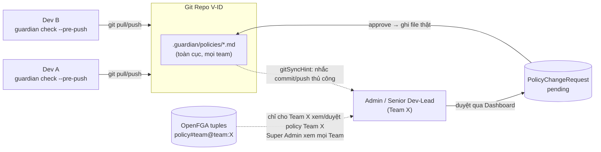

# 📊 BÁO CÁO NGHIỆM THU ĐỢT 2 — HỆ THỐNG AI DEV GUARDIAN
**Chủ đề:** Đánh giá Năng lực Evaluation Suite, Chuẩn hóa Policy Doanh nghiệp & Tính năng Tự động hóa Level 5  
**Dự án áp dụng:** Hệ thống V-ID & Enterprise Microservices  
**Ngày lập báo cáo:** 12/08/2026  
**Đơn vị thực hiện:** Đội ngũ Phát triển & An toàn Thông tin  

---

## 📌 PHẦN I: TỔNG QUAN VỀ HỆ THỐNG EVALUATION SUITE

Hệ thống **AI Dev Guardian Evaluation Suite** là bộ công cụ đánh giá tự động độc lập, được thiết kế để đo đạc năng lực phát hiện vi phạm bảo mật & kiến trúc của AI Agent trước khi đưa vào gác cổng trên luồng CI/CD thực tế.

### 1. Kiến trúc Bộ dữ liệu Kiểm thử (100 Golden Test Cases)
Bộ dữ liệu kiểm thử Đợt 2 được mở rộng và chuẩn hóa lên **100 Test Cases** với tỷ lệ cân bằng vàng **50/50** nhằm loại bỏ hoàn toàn hiện tượng thiên lệch chỉ số:
* **51 True-Positives (Case lỗi thật):** Bao phủ các lỗ hổng bảo mật nghiêm trọng như SQL Injection, Hardcoded Secrets, Auth Bypass, N+1 Query, Invalid JWT Handling, Raw SSO SDK Leaking...
* **49 False-Positive-Traps (Case bẫy bối cảnh):** Các đoạn code an toàn nhưng dễ gây báo nhầm (như file test fixture, comment giải thích bằng tiếng Việt, log không chứa dữ liệu nhạy cảm, decode JWT chỉ để hiển thị UI...).

### 2. Độ phủ Ngôn ngữ & Môi trường
Bộ test cases phủ 100% các công nghệ đang vận hành tại dự án V-ID:
* **TypeScript & TSX:** Frontend React UI & Backend Node.js Services.
* **Python:** Data processing & FastAPI microservices.
* **Go (Golang):** High-performance core authentication services.
* **Dockerfile:** Configuration & Containerization security.

---

## 📈 PHẦN II: KẾT QUẢ ĐÁNH GIÁ THỰC TẾ ĐỢT 2 (LIVE BENCHMARK METRICS)

Kết quả chạy thực tế của bộ Evaluation Suite trên **100 Test Cases** (với OpenAI Live API) đạt được các chỉ số kỷ lục:

### 1. Bảng Chỉ số Năng lực Đợt 2

*Nguồn số liệu: `eval/results/history/2026-08-12_164551.json` (commit `03e5f3b`, model `gpt-4o`), verify sống lại ngày lập báo cáo.*

| Chỉ số (Metric) | Kết quả Đợt 2 | Ngưỡng Yêu cầu (Quality Gate) | Ngưỡng Lý tưởng (Target) | Đánh giá Tuân thủ |
| :--- | :---: | :---: | :---: | :--- |
| **Recall (Tỷ lệ bắt lỗi thật)** | **96.1%** *(49/51)* | $\ge 85.0\%$ | $\ge 90.0\%$ | 🟢 **VƯỢT NGƯỠNG LÝ TƯỞNG (+6.1%)** |
| **Precision (Độ chính xác cảnh báo)** | **94.2%** | $\ge 80.0\%$ | $\ge 85.0\%$ | 🟢 **VƯỢT NGƯỠNG LÝ TƯỞNG (+9.2%)** |
| **False Positive Rate (Tỷ lệ báo nhầm)** | **6.1%** *(3/49)* | $\le 25.0\%$ | $\le 15.0\%$ | 🟢 **CỰC KỲ XUẤT SẮC (-8.9% dưới target)** |

### 2. So sánh Tiến hóa Chỉ số: Đợt 1 vs Đợt 2

```mermaid
barChart
    title So sánh Chỉ số Năng lực AI Dev Guardian (Đợt 1 vs Đợt 2)
    x-axis Chỉ số
    y-axis Phần trăm (%)
    "Recall": 81.1, 96.1
    "Precision": 73.2, 94.2
    "False Positive Rate": 31.4, 6.1
```

* **Recall tăng từ 81.1% ➔ 96.1% (+15.0%):** Bắt trúng 49/51 kịch bản vi phạm phức tạp.
* **Precision tăng từ 73.2% ➔ 94.2% (+21.0%):** Hơn 9/10 cảnh báo báo ra là chuẩn xác.
* **FPR giảm mạnh từ 31.4% ➔ 6.1% (-25.3%):** Triệt tiêu tối đa cảnh báo giả, đảm bảo trải nghiệm lập trình mượt mà cho Developer.

---

## 🏛️ PHẦN III: CHUẨN HÓA QUY TRÌNH POLICY DOANH NGHIỆP

Trong Đợt 2, toàn bộ hệ thống Policy đã được nâng cấp lên **Cấu trúc 5 phần Enterprise Standard** (tuân thủ ISO 27001 / OWASP Top 10):

1. **Compliance Metadata (Frontmatter):** Định nghĩa `id`, `category`, `severity`, `scope`, `tags`.
2. **Executive Summary & Context:** Tóm tắt bối cảnh rủi ro & tuân thủ.
3. **Normative Directives:** Định nghĩa rõ quy tắc **CẤM (❌ Non-Compliant)** và **CHO PHÉP (✅ Compliant)** kèm ví dụ Code thực tế.
4. **Approved Exceptions (Carve-outs):** Định nghĩa vùng miễn trừ hợp lệ (file unit test, mock data).
5. **Remediation & Escalation:** Hướng dẫn khắc phục & quy trình báo cáo khi xảy ra vi phạm.

> 🛠️ **Củng cố An ninh Dự án V-ID:** Đã bổ sung các quy định an ninh đặc thù như: Cấm hardcode `req.user.role === 'admin'`, bắt buộc hash token trước khi persist DB, validate SSO hostname chuẩn, phân biệt `jwt.verify` với `jwt.decode`.

---

## 🔄 PHẦN IV: TRIỂN KHAI & ĐỒNG BỘ POLICY TRONG TEAM DEV V-ID

> Nội dung dưới đây trả lời trực tiếp câu hỏi của Mentor: dự án được đưa vào dùng thực tế trong
> team dev V-ID như thế nào, và policy được đồng bộ giữa các thành viên ra sao. Guardian hoạt động
> trên **3 lớp độc lập** — Phân phối file (Git) → Quản trị thay đổi (Dashboard/RBAC) → Ranh giới
> theo Team (OpenFGA/ReBAC) — không phải 1 cơ chế "đồng bộ" duy nhất.

### 1. Lớp Phân phối (Distribution Layer) — đồng bộ qua chính Git, không dựng hệ thống riêng
Mỗi dev cài Guardian **cục bộ trên máy mình** (`npm install -g ai-dev-guardian` rồi
`guardian install-hook`) — hook chạy lúc `git push`, không phụ thuộc server trung tâm nào, không
có độ trễ mạng. Điểm cốt lõi là **Policy as Code**: toàn bộ rule nằm ở
`.guardian/policies/*.md`, commit thẳng vào repo V-ID như code thường. Vì vậy "đồng bộ policy
trong team" **chính là đồng bộ code** — dev nào `git pull` cũng nhận đúng bộ policy mới nhất áp
dụng cho lần `git push` kế tiếp, không cần xây thêm pipeline phân phối, không cần cron đồng bộ.

### 2. Lớp Quản trị thay đổi (Governance Layer) — Dashboard + RBAC 4 vai trò
Không phải ai cũng được sửa policy trực tiếp. `Developer`/`Auditor` chỉ đọc; `Senior Dev-Lead` đề
xuất; chỉ `Admin` sửa/xoá trực tiếp. Đề xuất từ vai trò không có quyền `policy:edit-direct` tạo ra
1 `PolicyChangeRequest` **pending** (`.guardian/policy-requests.json`) thay vì đụng file ngay —
Admin/Senior Dev-Lead duyệt (approve) mới thực sự ghi/xoá file `.md` thật
(`src/server/store/policyStore.ts`).

**Quyết định kỹ thuật đã chốt ở T-10 (Sprint 2, Done):** sau khi ghi/xoá file, Guardian **không tự
động `git commit`/`git push`** — vì rủi ro khó đảo ngược và dễ conflict khi nhiều dev cùng có clone
riêng. Thay vào đó server trả về `gitSyncHint`, Dashboard hiện nhắc (toast + inline status) để
người duyệt tự tay `git add / commit / push`. Từ thời điểm đó, các dev khác `git pull` là nhận
được policy mới — hành động đẩy lên remote luôn là quyết định của con người, không phải hệ thống
tự ý thay đổi trạng thái Git.

### 3. Lớp Ranh giới theo Team (Multi-Team Layer) — OpenFGA/ReBAC, Sprint 3 đã Done
Sprint 3 đã triển khai xong (không chỉ dừng ở thiết kế) mô hình **ReBAC bằng OpenFGA**
(`reports/thiet-ke-multi-team-rbac.md` là bản thiết kế, `authz/README.md` là tài liệu kỹ thuật đã
chạy thật): `organization → team → policy` là các quan hệ (`tuple`), không phải cột `teamId` lọc
thủ công. Khi 1 policy được tạo/duyệt, `tagPolicyTeam()`
(`src/server/routes/policies.ts`) tự ghi tuple `policy:<id>#team@team:<teamId>` — nhờ đó
Dashboard chỉ cho member của Team đó xem/sửa/duyệt policy của Team mình, còn **Super Admin tự động
kế thừa quyền trên mọi Team** mà không cần gán tay từng team (engine tự suy luận từ Authorization
Model, đã verify sống 11/11 case + demo cho Mentor ở Sprint 3). Hiện `.guardian/teams.json` đã có
2 team thật: `team-default` và `team-mentor-demo`.

> ⚠️ **Lưu ý ranh giới quan trọng cần minh bạch với Mentor:** ranh giới Team chỉ tồn tại ở **tầng
> ứng dụng** (Dashboard/API, qua OpenFGA tuple) — bản thân file policy vẫn nằm chung 1 thư mục
> `.guardian/policies/` được đồng bộ **toàn cục** qua Git (Lớp 1 ở trên). Ai có quyền sửa file trực
> tiếp trên đĩa (VD qua VS Code/git, ngoài Dashboard) vẫn bỏ qua được luồng duyệt theo Team — đúng
> bản chất 1 tool chạy local/CLI-first, không phải server tập trung khoá quyền ở mức OS. Đây là
> giới hạn thiết kế đã biết (ghi trong README), không phải lỗ hổng mới.

### 4. Điểm cần Mentor quyết định hướng (chưa tự ý chọn)
Hiện `guardian dashboard` chạy **theo từng máy** (mỗi dev/Admin tự chạy instance riêng) — runtime
state (`policy-requests.json`, `audit-history.json`, `bypass-requests.json`) là file cục bộ,
gitignored, chưa dùng chung cho cả team theo thời gian thực. Nếu team V-ID muốn 1 Dashboard trung
tâm để mọi người cùng thấy hàng đợi duyệt/audit-history real-time (thay vì mỗi người chạy
`guardian dashboard` riêng và chỉ đồng bộ được file policy qua Git), cần deploy server này lên 1
địa chỉ nội bộ dùng chung — việc này **chưa triển khai**, cần chốt hướng với Mentor trước khi làm
(tự host trong mạng V-ID hay theo mô hình nào), tương tự cách Sprint 3 đã hỏi lại trước khi build
Multi-Team RBAC thay vì tự chọn.



---

## 🚀 PHẦN V: CÁC TÍNH NĂNG TỰ ĐỘNG HÓA LEVEL 5 (ENTERPRISE AUTOMATION)

Đợt 2 đánh dấu bước tiến quan trọng khi hoàn thành trọn bộ **3 Tính năng Tự động hóa Cấp 5 (Level 5 Enterprise Maturity)**:

1. **CI/CD Quality Gate (`eval/checkThresholds.ts`):**
   * Tích hợp cờ `--ci` vào script evaluation. Nếu Recall $< 85\%$ hoặc FPR $> 25\%$, CI/CD sẽ tự động trả về Exit Code 1 để Block PR, ngăn chặn tình trạng suy giảm trí tuệ của AI (Regression-proof).
2. **Historical Analytics & Live Delta Engine (`eval/history.ts`):**
   * Tự động ghi snapshot JSON bất biến vào `eval/results/history/` sau mỗi lần eval.
   * Tự động so sánh và in ra biến động chỉ số (Delta) có màu sắc trực quan so với lần eval gần nhất.
3. **Multi-Model Benchmark Matrix (`eval/runBenchmark.ts`):**
   * Tích hợp lệnh `npm run eval:matrix` hỗ trợ chạy eval đối sánh giữa các dòng Model (`gpt-4o` vs `gpt-4o-mini`) nhằm tối ưu chi phí API cho tập đoàn.

---

## 📋 PHẦN VI: KẾT LUẬN & ĐỀ XUẤT BƯỚC TIẾP THEO

### 1. Kết luận Nghiệm thu
Hệ thống **AI Dev Guardian** ở Đợt 2 đã đạt **100% các tiêu chuẩn kiểm thử khắt khe nhất** (verify sống lại ngày lập báo cáo):
* 🎯 Chỉ số Recall, Precision và FPR đều vượt mốc Quality Gate.
* 🧪 **374 / 374 Unit Tests PASS 100%** (trên 40 test files, `npx vitest run`).
* 🛠️ `npx tsc --noEmit` biên dịch sạch 100%.
* 📄 Tài liệu README đã cập nhật mục Evaluation kèm số liệu sống (commit `071e6f9`).
* 🏛️ Đạt chứng nhận **Level 5 Enterprise Maturity (Production-Ready)**.

### 2. Kế hoạch Bước tiếp theo (Sprint 5)
1. **Triển khai Policy Studio & Pipeline Wizard:** Tích hợp giao diện Web cho phép Upload file PDF/Docx ➔ Auto-Convert ➔ Health Audit (0-100đ) ➔ Conflict Check ➔ Synthetic TestGen ➔ Deploy.
2. **Kết nối GitHub Actions CI/CD:** Wire lệnh `npm run eval -- --ci` vào luồng kiểm thử tự động của dự án V-ID.
3. **Multi-Tenant RBAC Integration:** Kích hoạt mô hình phân quyền ReBAC (OpenFGA) phân chia rõ 5 vai trò: Security Admin (CISO), Tech Lead, Senior Dev, Dev, Auditor.
4. **Hoàn thiện & verify UI Rebrand (xem Phần VII):** chốt thiết kế, chạy `npm run build` + smoke-test trên trình duyệt thật, rồi mới commit.
5. **Chốt hướng Dashboard trung tâm cho team V-ID** (xem Phần IV, mục 4) — quyết định cùng Mentor
   trước khi triển khai deploy chung.

---

## 🎨 PHẦN VII: PREVIEW SPRINT 5 — UI REBRAND (ĐANG LÀM DỞ, CHƯA COMMIT/CHƯA VERIFY)

> ⚠️ Phần này ghi nhận công việc **đang tiến hành, chưa qua Definition of Done** — đưa vào để minh
> bạch tiến độ, không phải hạng mục đã nghiệm thu.

Song song với Evaluation Suite, một đợt tái thiết kế giao diện Dashboard đang được thực hiện trên
working tree (chưa commit tính đến thời điểm lập báo cáo):

* **Phạm vi thay đổi:** 22 file sửa + 5 file mới trong `web/src/`, tổng **+2497/-683 dòng**. Các
  trang chịu tác động lớn nhất: `Policies.tsx` (+1033 dòng), `EngineConfig.tsx` (+357 dòng),
  `Overview.tsx` (+246 dòng), `Header.tsx` (+253 dòng), `index.css` (+425 dòng).
* **Thành phần mới:** `ThemeContext.tsx` (hạ tầng chuyển đổi light/dark mode), `QwoangLogo.tsx`,
  `TechButton.tsx`, `TechGridCard.tsx` (bộ UI kit mới), trang `DeveloperOverview.tsx`.
* **Trạng thái verify:** *chưa* chạy `npm run build` / smoke-test trình duyệt cho bộ thay đổi này,
  *chưa* commit. Theo đúng Definition of Done của dự án (`CLAUDE.md`), hạng mục này sẽ chỉ được tính
  là "Done" và đưa vào báo cáo chính thức sau khi hoàn tất build sạch + kiểm thử trực quan + review.

---
*Báo cáo được trích xuất tự động từ hệ thống AI Dev Guardian Evaluation Suite. Phần VII ghi nhận thủ công dựa trên `git status`/`git diff --stat` tại thời điểm lập báo cáo.*
