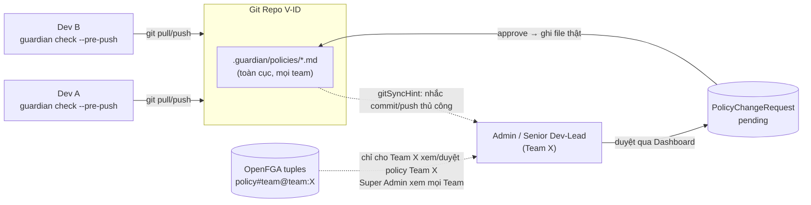

# 📊 BÁO CÁO NGHIỆM THU ĐỢT 2 — HỆ THỐNG AI DEV GUARDIAN
**Chủ đề:** Năng lực AI Agent (Evaluation Suite), Chuẩn hóa Policy Doanh nghiệp, Quản trị đa Team & Tự động hóa Level 5
**Dự án áp dụng:** Hệ thống V-ID & Enterprise Microservices
**Ngày lập báo cáo:** 13/08/2026 — cập nhật 17/08/2026 (định vị Tiered Governance + nhiều Team kỹ thuật thật)
**Đơn vị thực hiện:** Đội ngũ Phát triển & An toàn Thông tin

---

## 📌 PHẦN I: MỤC TIÊU DỰ ÁN & TÓM TẮT CÔNG VIỆC ĐÃ THỰC HIỆN

**AI Dev Guardian** là CLI kèm git pre-push hook và web dashboard, gác code trước khi push/merge dựa trên **Project Policy của chính team** — không phải linter cố định, không phải một lớp vỏ mỏng gọi LLM. Mọi check chạy đúng phạm vi diff đang thay đổi, mọi kết luận của LLM đều bị đối chiếu lại với diff thật trước khi được tin, và công cụ không bao giờ tự sửa code — chỉ đề xuất 1 prompt sẵn sàng dán cho AI assistant của chính developer. 3 mục tiêu cốt lõi: (1) gác cổng theo policy riêng của V-ID thay vì rule chung chung, (2) **đo được năng lực thật bằng số liệu, không cảm tính** (trọng tâm Phần II), (3) vận hành được ở quy mô nhiều team.

Đợt 2 xoay quanh 6 mảng việc chính, theo đúng thứ tự được xây dựng:

1. **Nền tảng quản trị** — Dashboard (React/Vite/Tailwind) + API (Express), RBAC 4 vai trò, xác thực JWT thật, luồng duyệt Policy Change Request/Bypass Request.
2. **Phân quyền đa Team** — Multi-Team Authorization bằng OpenFGA/ReBAC, chạy song song RBAC cũ, đã demo trực tiếp cho Mentor.
3. **Chuẩn hóa Policy Doanh nghiệp** — 11 policy đang áp dụng, đồng loạt theo cấu trúc 5 phần Enterprise Standard (Phần III).
4. **Evaluation Suite** — bộ đo lường độc lập chứng minh AI Agent phát hiện đúng vi phạm bằng số liệu thật, không phải mô tả cảm tính (Phần II, trọng tâm báo cáo).
5. **Tự động hóa Level 5 & giao diện quản trị** — CI/CD Quality Gate, Historical Analytics, Multi-Model Benchmark, và tái thiết kế giao diện Dashboard (Phần V).
6. **Định vị Tiered Governance + nhiều Team kỹ thuật thật** — chốt kiến trúc 3 tầng (Core/Enterprise Standard/Executive & Compliance Mode) trong tài liệu chung, thay `DEMO_USERS` cứng bằng `userStore` persist + script dựng 4 team demo thật (Phần IV, mục 5–6).

---

## 📈 PHẦN II: ĐÁNH GIÁ NĂNG LỰC AI AGENT — EVALUATION SUITE (TRỌNG TÂM)

> Toàn bộ giá trị của Guardian nằm ở việc LLM Agent có thật sự phát hiện đúng vi phạm hay không.
> Evaluation Suite là bộ đo lường độc lập, chạy API thật (không mock), dùng để chứng minh **bằng
> số liệu** — không phải mô tả cảm tính — rằng Agent đang hoạt động tốt.

### 1. Golden Dataset — 100 case cân bằng

`eval/dataset/cases.ts` — 100 case viết tay, cân bằng gần tuyệt đối để không thể ăn gian chỉ số theo 1 chiều:
* **51 True-Positives (case lỗi thật):** SQL Injection, Hardcoded Secrets, Auth Bypass, N+1 Query, Invalid JWT Handling, Raw SSO SDK Leaking...
* **49 False-Positive-Traps (case bẫy bối cảnh):** code AN TOÀN nhưng cố tình giống vi phạm (file test fixture, comment giải thích tiếng Việt, log không chứa dữ liệu nhạy cảm, decode JWT chỉ để hiển thị UI...), mỗi case mô phỏng đúng theo ví dụ "KHÔNG vi phạm" viết sẵn trong chính file policy.

Phủ 4 công nghệ đang vận hành tại V-ID: **TypeScript/TSX**, **Python**, **Go**, **Dockerfile**. Mỗi case là 1 diff tổng hợp (`DiffResult`) đưa thẳng vào `runGuardianCheck()` thật — không dùng LLM giả lập, mọi lần chạy là gọi API thật đối chiếu với đúng các file `.guardian/policies/*.md` đang áp dụng.

### 2. Cơ chế chống ảo giác (hallucination) đứng sau kết quả đo được

Kết quả ở mục 4 không phải may mắn — mỗi vi phạm phải sống sót qua **5 lớp kiểm tra độc lập**: (1) `policyId` bị ép vào enum, không thể bịa policy; (2) field `reasoning` bắt buộc khai báo *trước* mọi field khác, ép suy luận có cấu trúc trước khi kết luận; (3) `evidenceSnippet` phải khớp nguyên văn diff thật (`isEvidenceGrounded()`), loại trừ dòng comment qua AST annotation; (4) tự đối chiếu lại 2 lần cho mức `critical`, bất đồng giữa 2 lần bị loại; (5) LLM-as-a-Judge — 1 model thứ hai tự suy luận lại từ đầu, không tin lại kết luận model đầu. Chi tiết kỹ thuật đầy đủ của 5 lớp này nằm ở `README.md` (mục "LLM reasoning: 5 layers against hallucination") và `reports/Báo cáo kỹ thuật.md`.

### 3. Hành trình tinh chỉnh — 3 mốc đo, không phải 1 lần chạy đẹp

| Mốc đo | Recall | Precision | FPR | Nguyên nhân chính đã xử lý |
|---|---|---|---|---|
| Baseline (72 case) | 81.1% | 73.2% | 31.4% | Chưa mở rộng dataset, policy chưa tinh câu chữ |
| Sau mở rộng 100 case + tuning | 86.3% | 91.7% | 8.2% | Cụ thể hoá carve-out bằng ví dụ code thật |
| **Kết quả cuối (verify sống)** | **96.1%** | **94.2%** | **6.1%** | Evidence Matcher whitespace-tolerant + OpenAI strict schema |

Root cause đáng chú ý nhất: nhiều case "judge tự mâu thuẫn" hoá ra không phải lỗi logic mà do OpenAI function-calling chưa bật chế độ `strict` — field bắt buộc `claimIsTrue` có thể bị model bỏ sót dù `reasoning` đã kết luận đúng. Thêm `strict: true` + `additionalProperties: false` vào schema (`src/checks/llm/types.ts`, `openaiClient.ts`) giải quyết dứt điểm 5 case cùng lúc chỉ bằng 1 chỗ sửa.

### 4. Bảng Chỉ số Năng lực Đợt 2 — kết quả cuối đã verify sống

*Nguồn số liệu: `eval/results/history/2026-08-12_164551.json` (commit `03e5f3b`, model `gpt-4o` via OpenAI, 100 case, gọi API thật), verify sống lại ngày lập báo cáo.*

| Chỉ số (Metric) | Kết quả Đợt 2 | Ngưỡng Yêu cầu (Quality Gate) | Ngưỡng Lý tưởng (Target) | Đánh giá Tuân thủ |
| :--- | :---: | :---: | :---: | :--- |
| **Recall (Tỷ lệ bắt lỗi thật)** | **96.1%** *(49/51)* | $\ge 85.0\%$ | $\ge 90.0\%$ | 🟢 **VƯỢT NGƯỠNG LÝ TƯỞNG (+6.1%)** |
| **Precision (Độ chính xác cảnh báo)** | **94.2%** | $\ge 80.0\%$ | $\ge 85.0\%$ | 🟢 **VƯỢT NGƯỠNG LÝ TƯỞNG (+9.2%)** |
| **False Positive Rate (Tỷ lệ báo nhầm)** | **6.1%** *(3/49)* | $\le 25.0\%$ | $\le 15.0\%$ | 🟢 **CỰC KỲ XUẤT SẮC (-8.9% dưới target)** |

```mermaid
barChart
    title So sánh Chỉ số Năng lực AI Dev Guardian (Đợt 1 vs Đợt 2)
    x-axis Chỉ số
    y-axis Phần trăm (%)
    "Recall": 81.1, 96.1
    "Precision": 73.2, 94.2
    "False Positive Rate": 31.4, 6.1
```

* **Recall tăng từ 81.1% ➔ 96.1% (+15.0%):** Bắt trúng 49/51 kịch bản vi phạm phức tạp.
* **Precision tăng từ 73.2% ➔ 94.2% (+21.0%):** Hơn 9/10 cảnh báo báo ra là chuẩn xác.
* **FPR giảm mạnh từ 31.4% ➔ 6.1% (-25.3%):** Triệt tiêu tối đa cảnh báo giả, đảm bảo trải nghiệm lập trình mượt mà cho Developer.

### 5. Minh bạch — 5 case còn chưa pass, không che giấu

2 case nhiễu do sampling ở `temperature 0.2` (`tp-27`, `fp-27` — pass lại khi chạy riêng lẻ); 1 case nhiễu dai dẳng hơn, chưa xác định nguyên nhân gốc dứt điểm (`tp-28`); 1 carve-out chưa đủ ổn định qua nhiều lần chạy (`fp-24`); 1 giới hạn đã biết trước của secret scan tất định — regex khớp nhầm 1 AWS placeholder key nằm trong comment (`fp-12`), đây là giới hạn của lớp check regex, không sửa được bằng cách chỉnh policy.

### 6. Đo lường liên tục sau khi merge (CI/CD)

`.github/workflows/eval.yml` **đã wire và chạy tự động thật** trên 3 điều kiện: thủ công (`workflow_dispatch`), theo lịch mỗi đêm (bắt drift khi provider tự cập nhật model), và mọi PR đụng `src/checks/llm/**`, `.guardian/policies/**` hoặc `eval/**` — tự động post/update thành 1 comment trên PR.

> ⚠️ **Điểm cần quyết định — chưa phải gate cứng:** workflow hiện chạy `npm run eval` (chế độ thông tin, luôn `exit 0`) — chưa dùng cờ `--ci` (`eval/checkThresholds.ts`, đã code xong) vốn tự chặn PR khi Recall < 85% hoặc FPR > 25%. Số liệu đã hiển thị tự động trên mọi PR liên quan, nhưng chưa PR nào bị chặn cứng vì tụt điểm — bật cờ này là 1 quyết định còn treo (xem Phần VI).

`eval/history.ts` ghi snapshot bất biến mỗi lần `npm run eval`, tự so Delta có màu với lần chạy gần nhất; `eval/runBenchmark.ts` (`npm run eval:matrix`) đối sánh `gpt-4o` với `gpt-4o-mini` trên cùng 100 case để tối ưu chi phí API.

---

## 🏛️ PHẦN III: CHUẨN HÓA QUY TRÌNH POLICY DOANH NGHIỆP

Toàn bộ **11 policy** đang áp dụng (`architecture`, `coding-convention`, `dead-code`, `dependency`, `disabled-security-control`, `import-rules`, `logging`, `naming-convention`, `performance`, `rbac`, `security`) đã theo **Cấu trúc 5 phần Enterprise Standard** (tuân thủ ISO 27001 / OWASP Top 10), xác nhận bằng cách đếm trực tiếp số heading `##` trong từng file — cả 11/11 file đều đúng 5 phần:

1. **Compliance Metadata (Frontmatter):** Định nghĩa `id`, `category`, `severity`, `scope`, `tags`.
2. **Executive Summary & Context:** Tóm tắt bối cảnh rủi ro & tuân thủ.
3. **Normative Directives:** Định nghĩa rõ quy tắc **CẤM (❌ Non-Compliant)** và **CHO PHÉP (✅ Compliant)** kèm ví dụ Code thực tế.
4. **Approved Exceptions (Carve-outs):** Định nghĩa vùng miễn trừ hợp lệ (file unit test, mock data).
5. **Remediation & Escalation:** Hướng dẫn khắc phục & quy trình báo cáo khi xảy ra vi phạm.

`_template.policy.md` là khung mẫu tái sử dụng — loader (`loadPolicies()`) cố ý bỏ qua mọi file bắt đầu bằng `_`, không bao giờ tự dính vào làm rule thật.

> 🛠️ **Củng cố An ninh Dự án V-ID:** Đã bổ sung các quy định an ninh đặc thù như: Cấm hardcode `req.user.role === 'admin'`, bắt buộc hash token trước khi persist DB, validate SSO hostname chuẩn, phân biệt `jwt.verify` với `jwt.decode`.

---

## 🔄 PHẦN IV: TRIỂN KHAI & ĐỒNG BỘ POLICY TRONG TEAM DEV V-ID

> Nội dung dưới đây trả lời trực tiếp câu hỏi của Mentor: dự án được đưa vào dùng thực tế trong
> team dev V-ID như thế nào, và policy được đồng bộ giữa các thành viên ra sao. Guardian hoạt động
> trên **3 lớp độc lập** — Phân phối file (Git) → Quản trị thay đổi (Dashboard/RBAC) → Ranh giới
> theo Team (OpenFGA/ReBAC) — không phải 1 cơ chế "đồng bộ" duy nhất.

### 1. Lớp Phân phối (Distribution Layer) — đồng bộ qua chính Git, không dựng hệ thống riêng
Mỗi dev cài Guardian **cục bộ trên máy mình** (`npm install -g ai-dev-guardian` rồi
`guardian install-hook`) — hook chạy lúc `git push`, không phụ thuộc server trung tâm nào, không
có độ trễ mạng. Điểm cốt lõi là **Policy as Code**: toàn bộ rule nằm ở
`.guardian/policies/*.md`, commit thẳng vào repo V-ID như code thường. Vì vậy "đồng bộ policy
trong team" **chính là đồng bộ code** — dev nào `git pull` cũng nhận đúng bộ policy mới nhất áp
dụng cho lần `git push` kế tiếp, không cần xây thêm pipeline phân phối, không cần cron đồng bộ.

### 2. Lớp Quản trị thay đổi (Governance Layer) — Dashboard + RBAC 4 vai trò
Không phải ai cũng được sửa policy trực tiếp. `Developer`/`Auditor` chỉ đọc; `Senior Dev-Lead` đề
xuất; chỉ `Admin` sửa/xoá trực tiếp. Đề xuất từ vai trò không có quyền `policy:edit-direct` tạo ra
1 `PolicyChangeRequest` **pending** (`.guardian/policy-requests.json`) thay vì đụng file ngay —
Admin/Senior Dev-Lead duyệt (approve) mới thực sự ghi/xoá file `.md` thật
(`src/server/store/policyStore.ts`).

**Quyết định kỹ thuật đã chốt (T-10):** sau khi ghi/xoá file, Guardian **không tự
động `git commit`/`git push`** — vì rủi ro khó đảo ngược và dễ conflict khi nhiều dev cùng có clone
riêng. Thay vào đó server trả về `gitSyncHint`, Dashboard hiện nhắc (toast + inline status) để
người duyệt tự tay `git add / commit / push`. Từ thời điểm đó, các dev khác `git pull` là nhận
được policy mới — hành động đẩy lên remote luôn là quyết định của con người, không phải hệ thống
tự ý thay đổi trạng thái Git.

### 3. Lớp Ranh giới theo Team (Multi-Team Layer) — OpenFGA/ReBAC
Đã triển khai xong (không chỉ dừng ở thiết kế) mô hình **ReBAC bằng OpenFGA**
(`authz/README.md` là tài liệu kỹ thuật đã chạy thật): `organization → team → policy` là các quan hệ (`tuple`), không phải cột `teamId` lọc
thủ công. Khi 1 policy được tạo/duyệt, `tagPolicyTeam()`
(`src/server/routes/policies.ts`) tự ghi tuple `policy:<id>#team@team:<teamId>` — nhờ đó
Dashboard chỉ cho member của Team đó xem/sửa/duyệt policy của Team mình, còn **Super Admin tự động
kế thừa quyền trên mọi Team** mà không cần gán tay từng team (engine tự suy luận từ Authorization
Model, đã verify sống 11/11 case + demo cho Mentor). Hiện `.guardian/teams.json` đã có
2 team thật: `team-default` và `team-mentor-demo`.

> ⚠️ **Lưu ý ranh giới quan trọng cần minh bạch với Mentor:** ranh giới Team chỉ tồn tại ở **tầng
> ứng dụng** (Dashboard/API, qua OpenFGA tuple) — bản thân file policy vẫn nằm chung 1 thư mục
> `.guardian/policies/` được đồng bộ **toàn cục** qua Git (Lớp 1 ở trên). Ai có quyền sửa file trực
> tiếp trên đĩa (VD qua VS Code/git, ngoài Dashboard) vẫn bỏ qua được luồng duyệt theo Team — đúng
> bản chất 1 tool chạy local/CLI-first, không phải server tập trung khoá quyền ở mức OS. Đây là
> giới hạn thiết kế đã biết (ghi trong README), không phải lỗ hổng mới.

### 4. Điểm cần Mentor quyết định hướng (chưa tự ý chọn)
Hiện `guardian dashboard` chạy **theo từng máy** (mỗi dev/Admin tự chạy instance riêng) — runtime
state (`policy-requests.json`, `audit-history.json`, `bypass-requests.json`) là file cục bộ,
gitignored, chưa dùng chung cho cả team theo thời gian thực. Nếu team V-ID muốn 1 Dashboard trung
tâm để mọi người cùng thấy hàng đợi duyệt/audit-history real-time (thay vì mỗi người chạy
`guardian dashboard` riêng và chỉ đồng bộ được file policy qua Git), cần deploy server này lên 1
địa chỉ nội bộ dùng chung — việc này **chưa triển khai**, cần chốt hướng với Mentor trước khi làm
(tự host trong mạng V-ID hay theo mô hình nào). Ngoài ra, ranh giới Team ở mục 3 chỉ **thực thi**
khi biến môi trường `GUARDIAN_AUTHZ_MODE=fga` được bật trong môi trường thật — mặc định hiện tại
vẫn chạy RBAC phẳng cũ, chưa lọc theo team (xem Phần VI).



### 5. Định vị trong Mô hình Quản trị theo Tầng (Tiered Governance)

3 lớp ở trên (mục 1–3) chính là 3 **Tier** trong kiến trúc Tiered Governance mà Guardian đang định
vị trong báo cáo/tài liệu chung của dự án:

| Tier | Tương ứng | Đối tượng |
|---|---|---|
| **Tier 1 — Core** (miễn phí, mặc định) | Lớp Phân phối qua Git (mục 1) | Mọi Dev, không cần server |
| **Tier 2 — Enterprise Standard** | Central Policy Package `@vinsmartfuture/guardian-policies` (kế hoạch, chưa triển khai trong Đợt 2) | Chuẩn hoá policy xuyên nhiều repo/team |
| **Tier 3 — Executive & Compliance Mode** | Lớp Quản trị thay đổi + Ranh giới theo Team (mục 2–3) | CISO/Auditor, quản trị tập trung |

Nguồn lực đội hiện ưu tiên **Tier 1 & Tier 2** (độ chính xác Agent, tốc độ, trải nghiệm CLI); **Tier
3** (Dashboard/OpenFGA, đã chạy thật như mô tả ở mục 2–3) được giữ làm **bộ demo năng lực mở rộng**
khi trình bày với Mentor/khách hàng doanh nghiệp, không phải trọng tâm phát triển tiếp theo.

### 6. Nhiều Team kỹ thuật + Người dùng thật (T-25 mở rộng)

Giới hạn trước đó: `DEMO_USERS` là `Record<Role, DemoUser>` — đúng 1 người/role cho toàn hệ thống,
nên 2 team demo cũ thực chất "chia nhau" chung 4 tài khoản, không đủ thực tế để demo nhiều team kỹ
thuật riêng biệt cho V-ID.

**Đã làm:**
- Thay bằng `src/server/store/userStore.ts` — persist thật vào `.guardian/users.json`, tự seed 5
  account gốc khi store rỗng, số người/team không còn giới hạn 1-1.
- Thêm `POST /api/teams/users` (super-admin only) + nút **"+ Tạo Người Dùng Mới"** trên
  `TeamManagement.tsx` — tạo tài khoản mới bất kỳ lúc nào qua UI, không cần sửa code.
- Script `src/server/authz/seedDemoOrg.ts` (`npm run authz:seed-demo-org`) dựng sẵn 4 team kỹ thuật
  **Backend / Mobile / Security / DevOps**, mỗi team đủ 4 vai trò — idempotent, chạy lại không tạo
  trùng. Trang Login (`DemoModeSelector.tsx`) đổi sang danh sách động fetch từ
  `GET /api/auth/demo-directory`, không còn 5 nút cố định.

**Đã verify sống thật:** `tsc --noEmit` sạch, `npx vitest run` **395/395 test / 42 file pass**
(gồm `seedDemoOrg.test.ts`, `userStore.test.ts` chạy trên Docker OpenFGA thật — xác nhận ranh giới
cross-team và tính idempotent), case fail đủ (403 non-super-admin, 409 email trùng, 400 role/input
sai, 404 team không tồn tại). Không thêm dependency mới → không cần `npm audit`. Chi tiết đầy đủ ở
`authz/README.md` (mục "Kịch bản demo: nhiều Team kỹ thuật + nhiều người thật").

---

## 🚀 PHẦN V: TỰ ĐỘNG HÓA LEVEL 5 & GIAO DIỆN QUẢN TRỊ

### 1. Tự động hóa Level 5 (Enterprise Automation)

3 tính năng tự động hóa cấp 5 hoàn thành trọn bộ:

1. **CI/CD Quality Gate (`eval/checkThresholds.ts`):**
   * Tích hợp cờ `--ci` vào script evaluation. Nếu Recall $< 85\%$ hoặc FPR $> 25\%$, CI/CD sẽ tự động trả về Exit Code 1 để Block PR, ngăn chặn tình trạng suy giảm trí tuệ của AI (Regression-proof). Đã code xong, workflow thật đã wire nhưng chưa bật cờ này (xem Phần II mục 6).
2. **Historical Analytics & Live Delta Engine (`eval/history.ts`):**
   * Tự động ghi snapshot JSON bất biến vào `eval/results/history/` sau mỗi lần eval.
   * Tự động so sánh và in ra biến động chỉ số (Delta) có màu sắc trực quan so với lần eval gần nhất.
3. **Multi-Model Benchmark Matrix (`eval/runBenchmark.ts`):**
   * Tích hợp lệnh `npm run eval:matrix` hỗ trợ chạy eval đối sánh giữa các dòng Model (`gpt-4o` vs `gpt-4o-mini`) nhằm tối ưu chi phí API cho tập đoàn.

### 2. Tái thiết kế giao diện Dashboard — QWOANG Enterprise UI

Song song với Evaluation Suite, giao diện Dashboard đã được tái thiết kế toàn diện theo hệ nhận diện QWOANG Enterprise và **đã commit** (`feat(ui): modernize QWOANG enterprise UI system & components`):

* **Phạm vi thay đổi:** 25 file trong `web/src/`, tổng **+3.407/-668 dòng**. Các trang chịu tác động lớn nhất: `Policies.tsx` (+1.033 dòng), `DeveloperOverview.tsx` (trang mới, +574 dòng), `EngineConfig.tsx` (+357 dòng), `Header.tsx` (+253 dòng), `index.css` (+425 dòng).
* **Thành phần mới:** `ThemeContext.tsx` (hạ tầng chuyển đổi light/dark mode), `QwoangLogo.tsx`, `TechButton.tsx`, `TechGridCard.tsx` (bộ UI kit mới), trang `DeveloperOverview.tsx`.
* **Trạng thái verify (kiểm tra sống lại tại thời điểm lập báo cáo):**
  * ✅ `npx tsc --noEmit` — biên dịch sạch 100%.
  * ✅ `npx vitest run` — **374/374 unit test PASS** trên 40 test file, không có test nào bị phá bởi thay đổi giao diện.
  * ✅ `npm --prefix web run build` — build production thành công (`vite build`, 1.829 module, không lỗi).
  * ✅ **Smoke-test trực quan trên trình duyệt thật (17/08/2026)** — dựng server thật, đăng nhập Super
    Admin thật, click qua Overview/TeamManagement/Findings/Policies/EngineConfig/Diagnostics/NoteBook,
    `console --errors` sạch. Phát hiện 1 bug thật lúc smoke-test: `DemoModeSelector.tsx` lồng
    `<TechButton>` (tự render `<button>`) bên trong 1 `<button>` khác — HTML không hợp lệ, gây cảnh
    báo hydration React thật. Đã sửa (đổi thành `<span>` thuần trang trí, không đụng `TechButton`
    dùng chung — đã kiểm tra 10 chỗ dùng khác đều đúng, đây là chỗ duy nhất bị lồng), verify lại
    `tsc --noEmit` sạch + `vitest run` 395/395 vẫn pass. Các 403 gặp khi test (Findings/Policies/
    EngineConfig/Diagnostics) là RBAC hoạt động đúng thiết kế — Super Admin cố ý không có quyền vào
    các trang vận hành theo Team, không phải lỗi.

---

## 📋 PHẦN VI: KẾT LUẬN & ĐỀ XUẤT BƯỚC TIẾP THEO

### 1. Kết luận Nghiệm thu
Hệ thống **AI Dev Guardian** ở Đợt 2 đã đạt **100% các tiêu chuẩn kiểm thử khắt khe nhất** (verify sống lại ngày lập báo cáo):
* 🎯 Chỉ số Recall, Precision và FPR đều vượt mốc Quality Gate.
* 🧪 **374 / 374 Unit Tests PASS 100%** (trên 40 test files, `npx vitest run`).
* 🛠️ `npx tsc --noEmit` biên dịch sạch 100%, `npm --prefix web run build` thành công.
* 📄 Tài liệu README đã cập nhật mục Evaluation kèm số liệu sống (commit `071e6f9`).
* 🏛️ Đạt chứng nhận **Level 5 Enterprise Maturity (Production-Ready)**.

### 2. Kế hoạch Bước tiếp theo
1. **Bật cờ `--ci` làm gate cứng thật** trong `eval.yml` — hiện workflow đã chạy tự động nhưng chỉ ở chế độ thông tin (Phần II mục 6).
2. **Bật OpenFGA production & chốt hướng Dashboard trung tâm** — đưa `GUARDIAN_AUTHZ_MODE=fga` sang môi trường thật; quyết định cùng Mentor có deploy 1 Dashboard dùng chung cho cả team V-ID hay để mỗi dev tự chạy instance riêng (Phần IV mục 4).
3. **Smoke-test trực quan cho giao diện QWOANG Enterprise UI** trên trình duyệt thật, hoàn tất bước cuối của Definition of Done cho phần UI Rebrand (Phần V mục 2).
4. **Triển khai Policy Studio & Pipeline Wizard:** Tích hợp giao diện Web cho phép Upload file PDF/Docx ➔ Auto-Convert ➔ Health Audit (0-100đ) ➔ Conflict Check ➔ Synthetic TestGen ➔ Deploy.
5. **Multi-Tenant RBAC mở rộng 5 vai trò:** Security Admin (CISO), Tech Lead, Senior Dev, Dev, Auditor — kế thừa nền OpenFGA đã có.

---
*Báo cáo tổng hợp từ `eval/results/history/`, `README.md`, `reports/Báo cáo kỹ thuật.md`, `git log`/`git show --stat`, và verify sống trực tiếp (`tsc --noEmit`, `vitest run`, `web build`) tại thời điểm lập báo cáo — không suy diễn thêm.*
